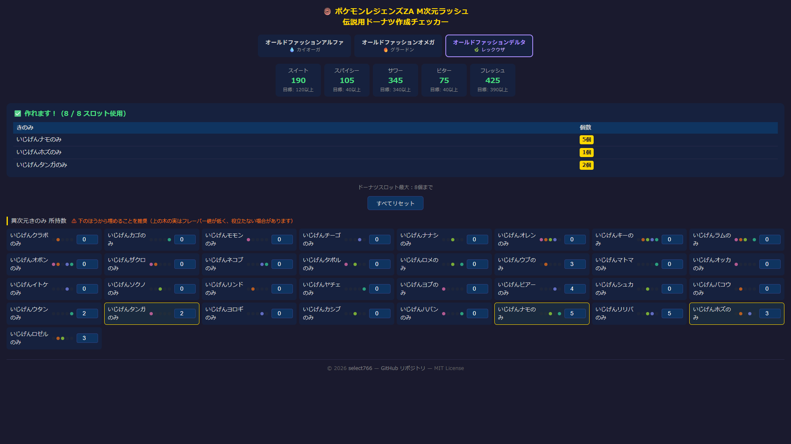

# pokemon-za-donut-solver

ポケモンレジェンズ Z-A DLC「M次元ラッシュ」で入手できる異次元きのみの所持数を入力し、  
伝説ポケモン用の特別ドーナツが作れる組み合わせを自動計算するツールです。



## 使い方

`index.html` をブラウザで開き、作りたいドーナツを選択してから各きのみの所持数を入力してください。  
条件を満たすレシピが存在する場合、使うきのみと個数がリアルタイムで表示されます。

> **ヒント：** フレーバー値が低いきのみ（リスト上部）は役立たない可能性が高いため、  
> 下の方（フレーバー値の高いきのみ）から埋めることを推奨します。

## 対応ドーナツと作成条件

ドーナツスロット上限：**8個**

### オールドファッションアルファ（💧 カイオーガ）

| フレーバー | 必要値 |
|-----------|--------|
| スイート   |  50以上 |
| スパイシー |  50以上 |
| サワー     | 210以上 |
| ビター     | 180以上 |
| フレッシュ | 370以上 |

### オールドファッションオメガ（🔥 グラードン）

| フレーバー | 必要値 |
|-----------|--------|
| スイート   | 260以上 |
| スパイシー | 160以上 |
| サワー     | 160以上 |
| ビター     |  20以上 |
| フレッシュ | 260以上 |

### オールドファッションデルタ（🌿 レックウザ）

| フレーバー | 必要値 |
|-----------|--------|
| スイート   | 120以上 |
| スパイシー |  40以上 |
| サワー     | 340以上 |
| ビター     |  40以上 |
| フレッシュ | 390以上 |

## berries.json

### 概要

全33種の異次元きのみのフレーバー値と、3種のドーナツ作成条件をまとめたデータファイルです。

### スキーマ

```jsonc
{
  "meta": {
    "game": "...",
    "dlc": "...",
    "maxSlots": 8,
    "donuts": {
      "alpha": { "label": "...", "pokemon": "...", "conditions": { "sweet": 50, ... } },
      "omega": { ... },
      "delta": { ... }
    },
    "sources": [ ... ]
  },
  "berries": [ ... ]
}
```

#### `berries` 各要素のフィールド

| フィールド | 型     | 説明 |
|-----------|--------|------|
| `name`    | string | 日本語名（例：`いじげんナモのみ`） |
| `en`      | string | 英語名（Serebii 準拠、例：`Hyper Colbur`） |
| `sweet`   | number | スイートフレーバー値 |
| `spicy`   | number | スパイシーフレーバー値 |
| `sour`    | number | サワーフレーバー値 |
| `bitter`  | number | ビターフレーバー値 |
| `fresh`   | number | フレッシュフレーバー値 |

### きのみ一覧

| 日本語名 | 英語名 | スイート | スパイシー | サワー | ビター | フレッシュ |
|---------|--------|---------|-----------|--------|--------|-----------|
| いじげんクラボのみ | Hyper Cheri  |  0 | 40 |  0 |  0 |  0 |
| いじげんカゴのみ   | Hyper Chesto |  0 |  0 |  0 |  0 | 40 |
| いじげんモモンのみ | Hyper Pecha  | 40 |  0 |  0 |  0 |  0 |
| いじげんチーゴのみ | Hyper Rawst  |  0 |  0 |  0 | 40 |  0 |
| いじげんナナシのみ | Hyper Aspear |  0 |  0 | 40 |  0 |  0 |
| いじげんオレンのみ | Hyper Oran   | 10 | 20 | 15 | 15 |  0 |
| いじげんキーのみ   | Hyper Persim |  0 | 15 | 15 | 10 | 20 |
| いじげんラムのみ   | Hyper Lum    | 20 | 15 | 10 |  0 | 15 |
| いじげんオボンのみ | Hyper Sitrus | 15 | 10 |  0 | 20 | 15 |
| いじげんザクロのみ | Hyper Pomeg  | 30 | 35 |  0 |  0 |  5 |
| いじげんネコブのみ | Hyper Kelpsy |  5 |  0 |  0 | 30 | 35 |
| いじげんタポルのみ | Hyper Qualot | 35 |  0 | 30 |  5 |  0 |
| いじげんロメのみ   | Hyper Hondew |  0 |  5 | 35 |  0 | 30 |
| いじげんウブのみ   | Hyper Grepa  |  0 | 60 | 25 |  0 |  5 |
| いじげんマトマのみ | Hyper Tamato |  5 | 25 |  0 |  0 | 60 |
| いじげんオッカのみ | Hyper Occa   | 60 |  0 |  0 |  5 | 25 |
| いじげんイトケのみ | Hyper Passho | 25 |  0 |  5 | 60 |  0 |
| いじげんソクノのみ | Hyper Wacan  |  0 |  5 | 60 | 25 |  0 |
| いじげんリンドのみ | Hyper Rindo  | 15 | 55 |  0 |  5 | 25 |
| いじげんヤチェのみ | Hyper Yache  | 25 |  0 |  5 | 15 | 55 |
| いじげんヨプのみ   | Hyper Chople | 55 |  5 | 15 | 25 |  0 |
| いじげんビアーのみ | Hyper Kebia  |  0 | 15 | 25 | 55 |  5 |
| いじげんシュカのみ | Hyper Shuca  |  5 | 25 | 55 |  0 | 15 |
| いじげんバコウのみ | Hyper Coba   | 10 | 95 |  0 | 10 |  5 |
| いじげんウタンのみ | Hyper Payapa |  5 |  0 | 10 | 10 | 95 |
| いじげんタンガのみ | Hyper Tanga  | 95 | 10 | 10 |  5 |  0 |
| いじげんヨロギのみ | Hyper Charti |  0 | 10 |  5 | 95 | 10 |
| いじげんカシブのみ | Hyper Kasib  | 10 |  5 | 95 |  0 | 10 |
| いじげんハバンのみ | Hyper Haban  | 85 |  0 |  0 |  0 | 65 |
| いじげんナモのみ   | Hyper Colbur |  0 |  0 | 65 |  0 | 85 |
| いじげんリリバのみ | Hyper Babiri |  0 |  0 | 65 | 85 |  0 |
| いじげんホズのみ   | Hyper Chilan |  0 | 85 |  0 | 65 |  0 |
| いじげんロゼルのみ | Hyper Roseli |  0 | 65 | 85 |  0 |  0 |

### 出典

- https://kokorogu.com/za-kinomi
- https://serebii.net/legendsz-a/anshasdonuts.shtml
- https://altema.jp/legendsza/oldalpha
- https://altema.jp/legendsza/olddelta
- https://gamewith.jp/pokemon-za/534208
- https://game8.jp/pokemon-legends-z-a/749730
